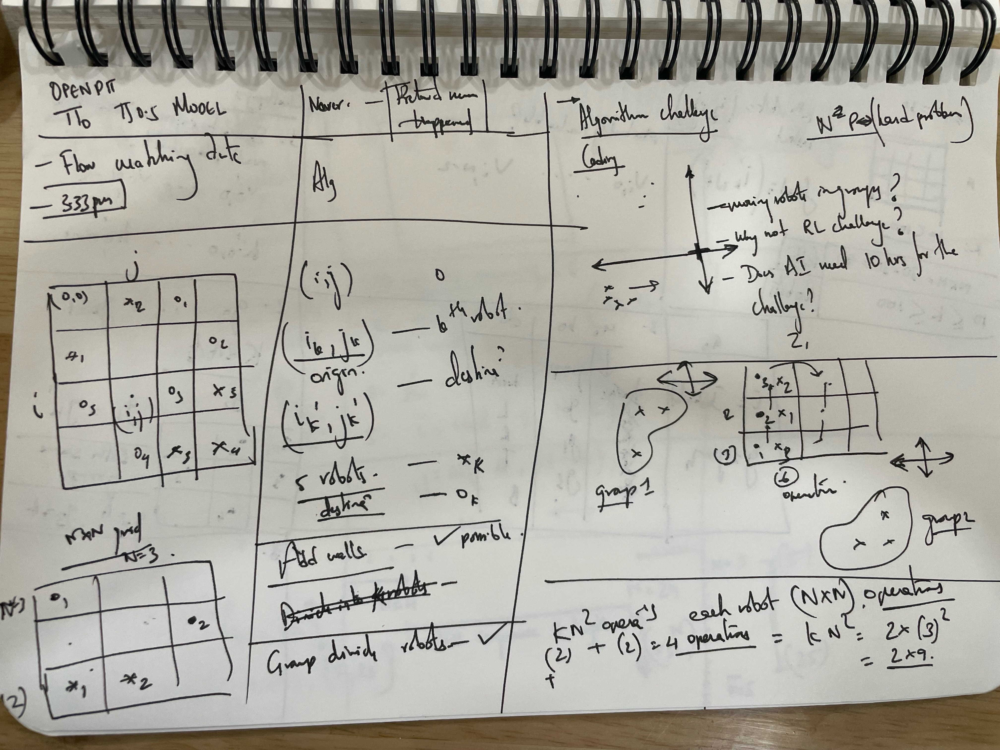
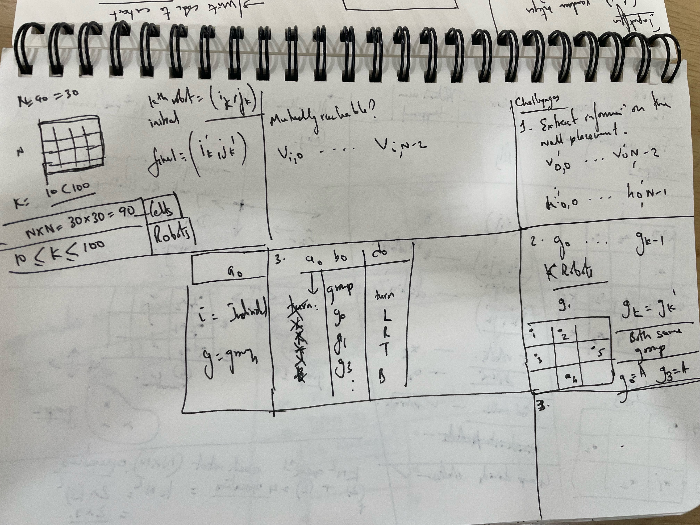

## Solution from Pyscho
Winner got $1 million 



- Assumed to be N=30, i.e the grid is a 30 x 30 square. 
- Robot number is 30 ( 10<K<100 )
- Movement can happen through group control or individual control
- Movement control is sent as L, R, T, B : [Left, Right, Top, Bottom]
- Location of k_th robot [i, j]
- Destination of k_th Robot [i_k', j_k']
- Max of K x N x N operations which turns out to be K robots x 30 x 30 operations (Each robot can move across the grid in 30 x 30 manner)
- Mutually reachable (from A--> B or B-->A)

## Input Format


## Output Format

1. Include the information on the wall placement

    v_0,0 -- v_0,N-2
    h_0,0 -- h_0, N-1

2. g_0, .... g_k-1
  
   If values are the same for any 2 or more, they are part of same group.

3. a_0,   b_0,  d0

   a_0
   Output = i/g
   either individual or group

   b_0
   which individual or group

   c_0
   Turn value: Left, Right, Up and Bottom




- Walls (Add walls across the grid)
- Grid shows all the possible locations of the grid (within shaded region)
- Wall adjacency conditions


- [Usage](#usage)
  - [Requirements](#requirements)
  - [Input Generation](#input-generation)
  - [Visualization](#visualization)
- [使い方](#%E4%BD%BF%E3%81%84%E6%96%B9)
  - [実行環境](#%E5%AE%9F%E8%A1%8C%E7%92%B0%E5%A2%83)
  - [入力生成](#%E5%85%A5%E5%8A%9B%E7%94%9F%E6%88%90)
  - [ビジュアライザ](#%E3%83%93%E3%82%B8%E3%83%A5%E3%82%A2%E3%83%A9%E3%82%A4%E3%82%B6)

# Usage

## Requirements
Please install a compiler for Rust language (see https://www.rust-lang.org).
If a compile error occurs, the compiler version may be old.
You can update to the latest compiler by executing the following command.
```
rustup update
```

For those who are not familiar with the Rust language environment, we have prepared a [pre-compiled binary for Windows](https://img.atcoder.jp/awtf2025heuristic/sJKH3KO4_windows.zip).
The following examples assume that you will be working in the directory where this README is located.

## Input Generation
The `in` directory contains pre-generated input files for seed=0-99.
If you want more inputs, prepare `seeds.txt` which contains a list of random seeds (unsigned 64bit integers) and execute the following command.
```
cargo run -r --bin gen seeds.txt
```
This will output input files into `in` directory.
When using the precompiled binary for Windows, execute the following command.
```
./gen.exe seeds.txt
```
If you use the command prompt instead of WSL, use `gen.exe` instead of `./gen.exe`.


The following options are available.

- `--dir=in2` Change the destination of the input files to the specified one instead of `in`.
- `--K=50` Fix the $K$ value of the generated inputs to the specified one.
- `--W=2` Fix the $W$ value of the generated inputs to the specified one.

## Visualization
Let `in.txt` be an input file and `out.txt` be an output file.
You can visualize the output by executing the following command.
```
cargo run -r --bin vis in.txt out.txt
```
When using the precompiled binary for Windows,
```
./vis.exe in.txt out.txt
```

The above command writes a visualization result to `vis.html`.
It also outputs the score to standard output.

You can also use a [web visualizer](https://img.atcoder.jp/awtf2025heuristic/sJKH3KO4.html?lang=en) which is more rich in features.

